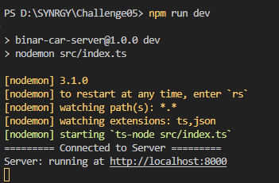
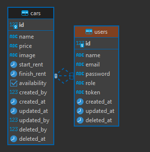

### SYNRGY 7 BINAR CHALLENGE 5 RESTFUL API FSW 2 BERDI GUMANTARA
This is a Restful API using Typescript, Node, Express, and for the image using cloudinary. to complete the Challenge 5 in SYNRGY binar  

### INSTRUCTION
1. Clone project into your local
2. Change directory to this project folder
3. Use command `npm install`
4. Make sure create file `env` and copy all of `env.example` 
   and change the value with your value in PostgresSql and API Cloudinary
5. Run command `npm run migrate:latest ` to condfirm create table via migration, 
   but if you wanna make new table run command `npm run migrate:make tableName`
6. Run command `npm run seed:run` to fill up table with data seeder!
7. Next step use command `npx tsc` if you wanna to compile TypeScript into JavaScript
8. For final step run command `npm run dev`
9. Make sure database already connected to your project like this
   


10. Have fun and enjoy!

*Notes : for the cURL i'm using Windows PowerShell to run the command, i don't know the command can work or not in macOs and linux. and if cURL doesn't work just use Postman.

### ENDPOINT LIST

| API ENDPOINT          | METHOD   |     DESCRIPTION        |
|-----------------------|----------|------------------------|
| `/api/cars`           |   `GET`  | Get All Data Cars      |
| `/api/cars/:id`       |   `GET`  | Get By Id Data Cars    |
| `/api/cars/create`    |  `POST`  | Post Data Cars         |
| `/api/cars/:id`       |   `PUT`  | Update Data Cars By Id |
| `/api/cars/:id`       | `DELETE` | Delete Data Cars By Id |

### REQUEST AND RESPONSE DATA
- **Show All Data Cars**
    - **Request** 
        - Endpoint : `/api/cars`
        - method : `GET`
    - **Get Data Success**
        - cURL Request :
          ```
          curl -i --location 'http://localhost:8000/api/cars'
          ```
        - cURL Response :
          ```
          HTTP/1.1 200 OK
          X-Powered-By: Express
          Content-Type: application/json; charset=utf-8
          Content-Length: 2696
          ETag: W/"a88-CVYg7Nn66BdTqWFirZxMz0zzkus"
          Date: Sun, 19 May 2024 08:56:36 GMT
          Connection: keep-alive
          Keep-Alive: timeout=5

          {"message":"Get all cars","cars":[{"id":1,"name":"Toyota","price":"Rp700.000","image":"https://images.bisnis.com/thumb/posts/2019/03/31/906567/supra-baru.jpg?w=450&h=237","start_rent":"2024-05-18T08:56:00.000Z","finish_rent":"2024-05-18T08:56:00.000Z","availability":true,"created_at":"2024-05-18T13:03:27.574Z","updated_at":"2024-05-18T13:03:27.574Z"},{"id":2,"name":"Subaru","price":"Rp900.000","image":"https://images.bisnis.com/thumb/posts/2019/03/31/906567/supra-baru.jpg?w=450&h=237","start_rent":"2024-05-18T08:56:00.000Z","finish_rent":"2024-05-18T08:56:00.000Z","availability":true,"created_at":"2024-05-18T13:03:27.574Z","updated_at":"2024-05-18T13:03:27.574Z"},{"id":3,"name":"Daihatsu","price":"Rp200.000","image":"https://media.suara.com/pictures/653x366/2022/09/03/54583-ilustrasi-daihatsu-sigra.jpg","start_rent":"2024-05-18T08:56:00.000Z","finish_rent":"2024-05-18T08:56:00.000Z","availability":true,"created_at":"2024-05-18T13:03:27.574Z","updated_at":"2024-05-18T13:03:27.574Z"},{"id":4,"name":"Civic","price":"Rp300.000","image":"https://imgcdn.oto.com/large/gallery/color/14/524/honda-civic-type-r-color-978755.jpg","start_rent":"2024-05-18T08:56:00.000Z","finish_rent":"2024-05-18T08:56:00.000Z","availability":false,"created_at":"2024-05-18T13:04:08.169Z","updated_at":"2024-05-18T13:04:08.169Z"},{"id":5,"name":"BMW","price":"Rp800.000","image":"https://www.bmw.co.id/content/dam/bmw/common/all-models/3-series/sedan/2022/navigation/bmw-3-series-sedan-lci-modelfinder.png","start_rent":"2024-05-18T08:56:00.000Z","finish_rent":"2024-05-18T08:56:00.000Z","availability":true,"created_at":"2024-05-18T13:05:46.427Z","updated_at":"2024-05-18T13:05:46.427Z"},{"id":6,"name":"Hyundai","price":"Rp400.000","image":"https://www.hyundai.com/content/dam/hyundai/id/en/data/vehicle-thumbnail/product/palisade-fl/default/palisade-fl-new-672.png","start_rent":"2024-05-18T08:56:00.000Z","finish_rent":"2024-05-18T08:56:00.000Z","availability":false,"created_at":"2024-05-18T13:08:56.407Z","updated_at":"2024-05-18T13:16:51.866Z"},{"id":11,"name":"Pazero","price":"Rp400.000","image":"http://res.cloudinary.com/dtpbuuaiz/image/upload/v1716088272/bcr/eso18bzepsjrnlor058h.jpg","start_rent":"2024-05-18T08:56:00.000Z","finish_rent":"2024-05-18T08:56:00.000Z","availability":true,"created_at":"2024-05-19T02:47:12.597Z","updated_at":"2024-05-19T03:11:13.223Z"},{"id":12,"name":"Pazero","price":"Rp400.000","image":"http://res.cloudinary.com/dtpbuuaiz/image/upload/v1716107586/bcr/fzgmie8y1dqncz3ivvvm.jpg","start_rent":"2024-05-18T08:56:00.000Z","finish_rent":"2024-05-18T08:56:00.000Z","availability":true,"created_at":"2024-05-19T02:53:00.569Z","updated_at":"2024-05-19T08:33:03.509Z"}]}
          ```

- **Show Data Cars By Id**
    - **Request** 
        - Endpoint : `/api/cars/:id`
        - Parameter: `:id`
        - method : `GET`
    - **Get Data By Id Success**
        - cURL Request :
          ```
          curl -i --location 'http://localhost:8000/api/cars/1'
          ```
        - cURL Response :
          ```
          HTTP/1.1 200 OK
          X-Powered-By: Express
          Content-Type: application/json; charset=utf-8
          Content-Length: 361
          ETag: W/"169-lQKO0UPQDCo3i1VB/VlSxwmO37E"
          Date: Sun, 19 May 2024 08:57:51 GMT
          Connection: keep-alive
          Keep-Alive: timeout=5

          {"message":"Get specific car by id","car":{"id":1,"name":"Toyota","price":"Rp700.000","image":"https://images.bisnis.com/thumb/posts/2019/03/31/906567/supra-baru.jpg?w=450&h=237","start_rent":"2024-05-18T08:56:00.000Z","finish_rent":"2024-05-18T08:56:00.000Z","availability":true,"created_at":"2024-05-18T13:03:27.574Z","updated_at":"2024-05-18T13:03:27.574Z"}}
          ```
    - **Get Data by Id Not Found**
        - cURL Request :
          ```
          curl -i --location 'http://localhost:8000/api/cars/20'
          ```
        - cURL Response :
          ```
          HTTP/1.1 404 Not Found
          X-Powered-By: Express
          Content-Type: application/json; charset=utf-8
          Content-Length: 28
          ETag: W/"1c-i9fgMU27EELKIv2h3Wnd98dVf0M"
          Date: Sun, 19 May 2024 08:58:52 GMT
          Connection: keep-alive
          Keep-Alive: timeout=5

          {"message":"Data Not Found"}
          ```

- **Create Data Cars**
    - **Request**
        - Endpoint : `/api/cars/create`
        - Body : `form-data`
        - Method : `POST`
    - **Post Data Success**
        - cURL Request :
          ```
          curl -i --location 'http://localhost:8000/api/cars/create' `
          --form "name=Supra old" `
          --form "price=Rp400.000" `
          --form "image=@C:/Users/guman/Downloads/PSX_20200619_075830.jpg" `
          --form "start_rent=2024-05-18 15:56:00" `
          --form "finish_rent=2024-05-19 15:56:00" `
          --form "availability=true"
          ```
        - cURL Response :
          ```
          HTTP/1.1 201 Created
          X-Powered-By: Express
          Content-Type: application/json; charset=utf-8
          Content-Length: 374
          ETag: W/"176-Zf9H4fxct9itQcY+cBAXYzXOmW4"
          Date: Sun, 19 May 2024 09:44:02 GMT
          Connection: keep-alive
          Keep-Alive: timeout=5

          {"message":"Car created successfully","car":{"name":"Supra old","price":"Rp400.000","image":"http://res.cloudinary.com/dtpbuuaiz/image/upload/v1716111844/bcr/sb2d1nhppphhenwngszk.jpg","start_rent":"2024-05-18T08:56:00.000Z","finish_rent":"2024-05-19T08:56:00.000Z","availability":true,"created_at":"2024-05-19T09:44:01.988Z","updated_at":"2024-05-19T09:44:01.988Z","id":14}}
          ```
    - **Post Data Failed (value of key name should Notnull)**
      - cURL Request :
        ```
        curl -i --location 'http://localhost:8000/api/cars/create' `
        --form "name =Supra old" `
        --form "price=Rp400.000" `
        --form "image=@C:/Users/guman/Downloads/PSX_20200619_075830.jpg" `
        --form "start_rent=2024-05-18 15:56:00" `
        --form "finish_rent=2024-05-19 15:56:00" `
        --form "availability=true"
        ```
      - cURL Response :
        ```
        X-Powered-By: Express
        Content-Type: application/json; charset=utf-8
        Content-Length: 541
        ETag: W/"21d-XWBwHOxdFK4fZhlsHgfEIFOQBrc"
        Date: Sun, 19 May 2024 09:53:11 GMT
        Connection: keep-alive
        Keep-Alive: timeout=5

        {"message":"Error creating car","error":{"name":"NotNullViolationError","nativeError":{"length":376,"name":"error","severity":"ERROR","code":"23502","detail":"Baris gagal berisi (15, null, Rp400.000, http://res.cloudinary.com/dtpbuuaiz/image/upload/v1716112393/bcr..., 2024-05-18 15:56:00+07, 2024-05-19 15:56:00+07, t, 2024-05-19 16:53:11.234+07, 2024-05-19 16:53:11.234+07)","schema":"public","table":"cars","column":"name","file":"execMain.c","line":"2009","routine":"ExecConstraints"},"client":"postgres","table":"cars","column":"name"}}
        ```

- **Update Data Cars**
    - **Request**
        - Endpoint : `/api/cars/:id`
        - Parameter : `:id`
        - Body : `form-data`
        - Method : `PUT`
    - **Update Data Success**
        - cURL Request :
          ```
          curl --location --request PUT 'http://localhost:8000/api/cars/14'`
          --form "name=Supra x" `
          --form "price=Rp400.000" `
          --form "image=@C:/Users/guman/Downloads/2e12ea30848ffabd0a26e25724ebe8e5.jpg" `
          --form "start_rent=2024-05-18 15:56:00" `
          --form "finish_rent=2024-05-19 15:56:00" `
          --form "availability=false"
          ```
        - cURL Response :
          ```
          {"message":"Update a car","car":{"id":14,"name":"Supra x","price":"Rp400.000","image":"http://res.cloudinary.com/dtpbuuaiz/image/upload/v1716114427/bcr/vj5naxkjfda67rle670n.jpg","start_rent":"2024-05-18T08:56:00.000Z","finish_rent":"2024-05-19T08:56:00.000Z","availability":false,"created_at":"2024-05-19T09:44:01.988Z","updated_at":"2024-05-19T10:27:05.177Z"}}
          ```
    - **Update Data Failed Validation (availability with number or string)**
        - cURL Request :
          ```
          curl --location --request PUT 'http://localhost:8000/api/cars/14'`
          --form "name=Supra x" `
          --form "price=Rp400.000" `
          --form "image=@C:/Users/guman/Downloads/2e12ea30848ffabd0a26e25724ebe8e5.jpg" `
          --form "start_rent=2024-05-18 15:56:00" `
          --form "finish_rent=2024-05-19 15:56:00" `
          --form "availability=00"
          ```
        - cURL Response :
          ```
          {"message":"Error updating car","error":{"name":"DataError","nativeError":{"length":143,"name":"error","severity":"ERROR","code":"22P02","where":"unnamed portal parameter $6 = '...'","file":"bool.c","line":"154","routine":"boolin"},"client":"postgres"}}
          ```
    - **Update Data Failed Not Found**
        - cURL Request :
          ```
          curl --location --request PUT 'http://localhost:8000/api/cars/27'`
          --form "name=Supra x" `
          --form "price=Rp400.000" `
          --form "image=@C:/Users/guman/Downloads/2e12ea30848ffabd0a26e25724ebe8e5.jpg" `
          --form "start_rent=2024-05-18 15:56:00" `
          --form "finish_rent=2024-05-19 15:56:00" `
          --form "availability=false"
          ```
        - cURL Response :
          ```
          {"message":"Car not found"}
          ```

- **Delete Data Cars**
    - **Request**
        - Endpoint : `/api/cars/:id`
        - Parameter : `:id`
        - Method : `DELETE`
    - **Delete Data Success**
        - cURL Request :
          ```
          curl --location --request DELETE 'http://localhost:8000/api/cars/14'
          ```
        - cURL Response :
          ```
          {"message":"Delete a car","car":{"id":14,"name":"Supra x","price":"Rp400.000","image":"http://res.cloudinary.com/dtpbuuaiz/image/upload/v1716114554/bcr/cnalezrztp1dpa4904s5.jpg","start_rent":"2024-05-18T08:56:00.000Z","finish_rent":"2024-05-19T08:56:00.000Z","availability":false,"created_at":"2024-05-19T09:44:01.988Z","updated_at":"2024-05-19T10:29:12.262Z"}}
          ```
    - **Delete Data Not Found**
       - cURL Request :
         ```
         curl -i --location --request DELETE 'http://localhost:8000/api/cars/27'
         ```
       - cURL Response :
         ```
         {"message":"Data Not Found"}
         ```

### ERD (Entity Relationship Diagram)

